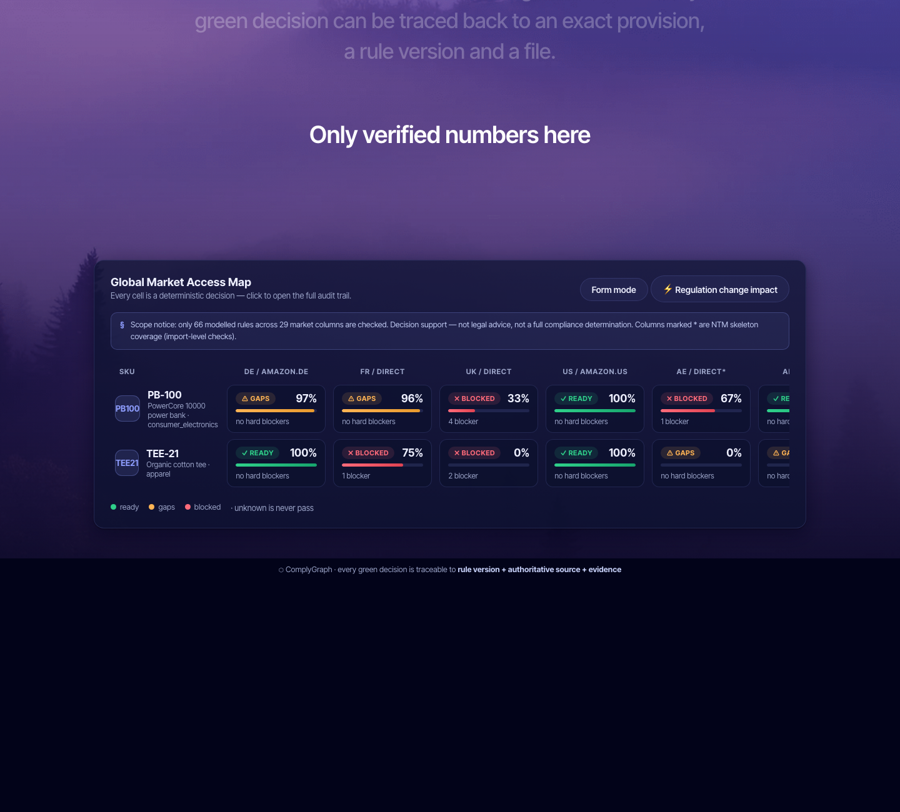

# ⬡ ComplyGraph

**Open-source, AI-native market-access engine for physical products.**
Enter your product facts and evidence files → check them against versioned rule packs → get a deterministic answer: **can this SKU be sold in each target market, what's missing, and what to do next** — every decision traceable, replayable, and auditable.

> An open-source engine that converts product facts, regulatory sources and compliance evidence into versioned, executable, auditable market-readiness decisions. **LLM drafts, the engine decides, humans approve.**

[中文文档](README.zh-CN.md) · [](https://github.com/g1304458637-afk/complygraph/actions/workflows/ci.yml) []() []() []()

---




*Every cell is a deterministic, auditable decision — click through to the rule version, legal provision and evidence behind it.*

## The problem it solves

Cross-border sellers don't lack regulatory information — they lack a **SKU-level state layer**. ComplyGraph turns:

```
dig through laws → hire service providers → chase supplier PDFs → track in spreadsheets → re-enter on platforms → re-check everything when rules change
```

into one deterministic pipeline:

```
Product facts → Legal classification → Versioned rule packs → Evidence validation → Market readiness + Blockers + Tasks
```

## Core invariants (enforced in code, not conventions)

1. **`unknown` is never pass** — when facts are insufficient to decide applicability, the rule becomes `unknown` and the market goes red/amber. There is no silent path to green.
2. **The LLM never decides** — models may only enter through evidence drafts (capped at `satisfied_unverified` until a human approves). Verdicts are locked inside the deterministic engine.
3. **Every green decision is auditable** — results are bound to rule version + authoritative legal citation + evidence, producing a SHA-256-addressed, independently replayable evaluation receipt (`cg.receipt.v1`).
4. **Legal rules and marketplace rules are separate layers** — platform fields filled ≠ legal compliance.

## Quickstart

```bash
python3 -m venv .venv && .venv/bin/pip install -e '.[dev]'
.venv/bin/python -m pytest -q          # 76 tests

# Web UI: SKU × market matrix + audit drill-down + conversational agent
.venv/bin/python -m complygraph.web --port 8765   # → http://127.0.0.1:8765

# CLI: evaluate a single SKU
.venv/bin/python -m complygraph.cli evaluate examples/products/pb100.yaml \
  --evidence examples/evidence/pb100_evidence.yaml --market de --channel amazon.de
```

## Features

| Capability | Entry point | What it does |
|---|---|---|
| Multi-market readiness matrix | Web `/` | DE/FR/UK/US deep rules + 25-country NTM skeleton; click any cell for the full audit trail; one-click CSV export |
| Conversational intake agent | Web `🤖 Agent intake` | Questions are *derived from the rule packs*; free-text chat powered by an LLM brain (PydanticAI + DeepSeek) with deterministic fallback |
| Evidence pipeline | `evidence-extract` / `evidence-approve` | PDF parsing + LLM extraction drafts → human approval → evidence bundle |
| Expiry radar | Web `⏰ Expiry radar` / `GET /api/expiring` | Declarations on file expire — flags evidence & registrations that lapsed or lapse within the window, before a market flips red |
| Regulation-change impact | `diff-rules` / `impact` | Semantic rule diff → affected SKUs → remediation tasks |
| Evaluation receipts | `evaluate --json` | Content-addressed, independently replayable decision credentials |
| Advisory layer | `advise` CLI + Web buttons + `POST /api/whatif` | Remediation how-tos, what-if counterfactuals (also a chat-brain tool), compliance-driven market ranking |

## Coverage (honest scope statement)

- **Markets**: Germany, France, UK, USA (deep rules) + a 25-market NTM skeleton (Japan, South Korea, China, Taiwan, India, Brazil, Mexico, UAE, Saudi Arabia, Singapore, Switzerland, Canada, Argentina, Chile, Colombia, South Africa, Türkiye, Russia/EAEU, Vietnam draft…) — import-level checks only;
- **Categories**: consumer electronics (battery products) is the deepest vertical — GPSR, Batteries Regulation, RED, transport (UN 38.3), RoHS, EMC, LVD, SCIP; toys (EN 71), cosmetics (CPNP/PIF/CPSR/MoCRA) and food contact (1935/2004 + FDA) have candidate skeletons; medical devices are an **educational skeleton only**; apparel is generic-rules-only. **Do not use for uncovered categories**;
- **Rule status**: everything is a **candidate** — every rule carries an authoritative citation, but none has been lawyer-verified yet (the `last_verified` field tracks this);
- **This tool is decision support. It is not legal advice and not a full compliance determination.**

Breadth comes from the [UNCTAD TRAINS / ITC MacMap](https://www.macmap.org/) NTM data structure (see `complygraph/sources/ntm.py`; full refresh needs a free WITS account). Depth is built market by market.

## Architecture

```
Web UI (matrix / conversational agent / impact view)
        │
  complygraph.web          ← stdlib http.server, zero runtime deps
        │
  engine.py  deterministic evaluator (fact predicates / evidence checks / readiness)
  loader.py  YAML rule DSL (stable ids + versions + authoritative citations + fixtures)
        │
  rulepacks/  eu/ de/ fr/ gb/ us/ global/ verticals/ channels/ ntm/
        │                          ▲
  diff.py + impact.py         sources/ntm.py   ← TRAINS/WITS data pipeline
  evidence_extract.py (LLM slot: fake | any OpenAI-compatible endpoint)
  agent_brain.py (PydanticAI + DeepSeek — conversational orchestration only)
        │
  receipt.py  cg.receipt.v1 (SHA-256 content-addressed, replayable)
```

**LLM boundary**: the model has exactly two jobs — drafting evidence (capped at `satisfied_unverified` until human review) and conversational orchestration (via tools that drive the structured session). The engine retains exclusive judging rights; without an API key everything falls back to deterministic mode.

## Adding a rule (contribution workflow)

1. Add YAML to the relevant rule pack (candidate status), with a mandatory `source` citation;
2. Add positive / negative / date-boundary fixture tests;
3. Have it verified against the cited source, then set `last_verified`. **Rules without citations and tests do not get merged.**

## Roadmap

- [x] Phases 0–2: engine + vertical slice + DE/FR/UK/US
- [x] Phase 3: evidence pipeline (human-approval gate)
- [x] Phase 4: rule diff + change impact
- [x] Tier-1 global skeleton: NTM pipeline + 25 markets
- [x] 100-SKU synthetic benchmark (**False Green Rate = 0 is the release gate**) — `scripts/benchmark_false_green.py`: outcomes known by construction, not by engine oracle; CI runs a seeded batch in `tests/test_false_green.py`
- [ ] Tier-2: official legislation APIs + LLM rule mining (EUR-Lex / eCFR / e-Gov)
- [ ] MCP server: let any agent call the compliance verdict

## License

MIT. Rule-pack contents (`rulepacks/`, `data/`) are candidate-quality data — always verify against the cited authoritative sources.

---

*This project is decision support tooling. It does not provide legal advice and does not guarantee compliance in any jurisdiction.*

---

> 🇨🇳 中文文档：[README.zh-CN.md](README.zh-CN.md)
